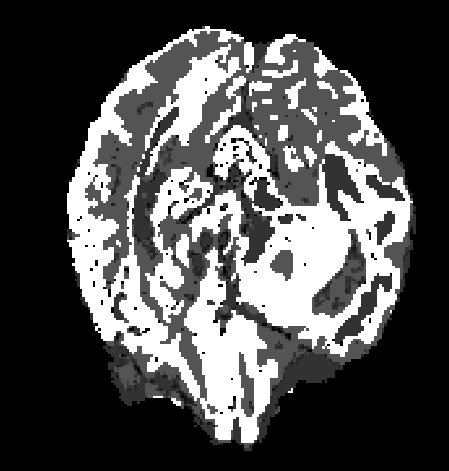
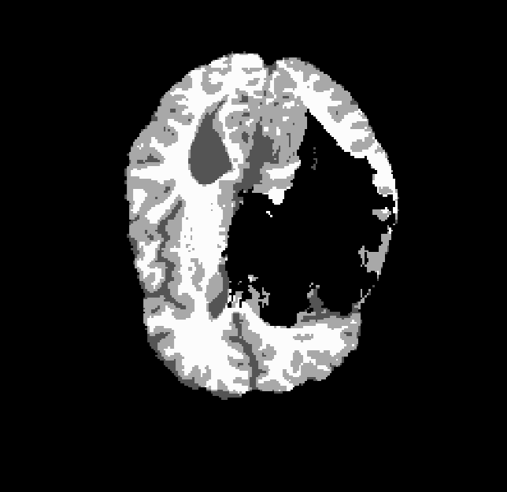
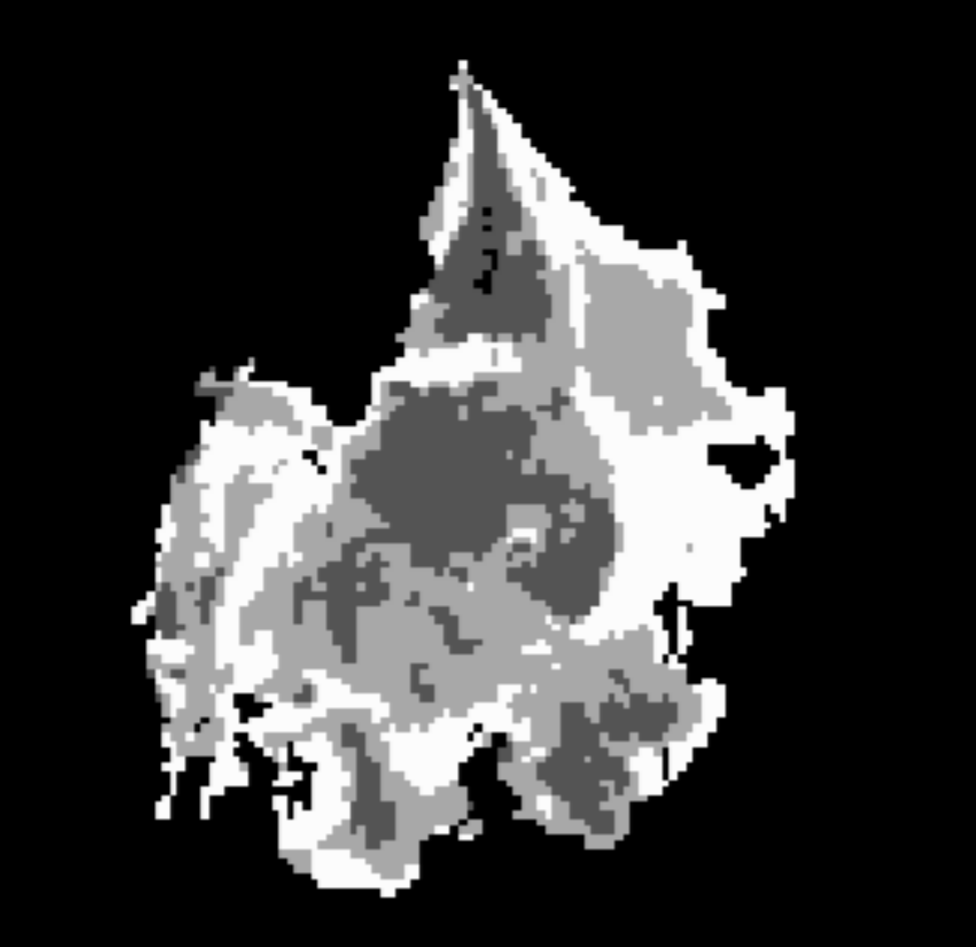
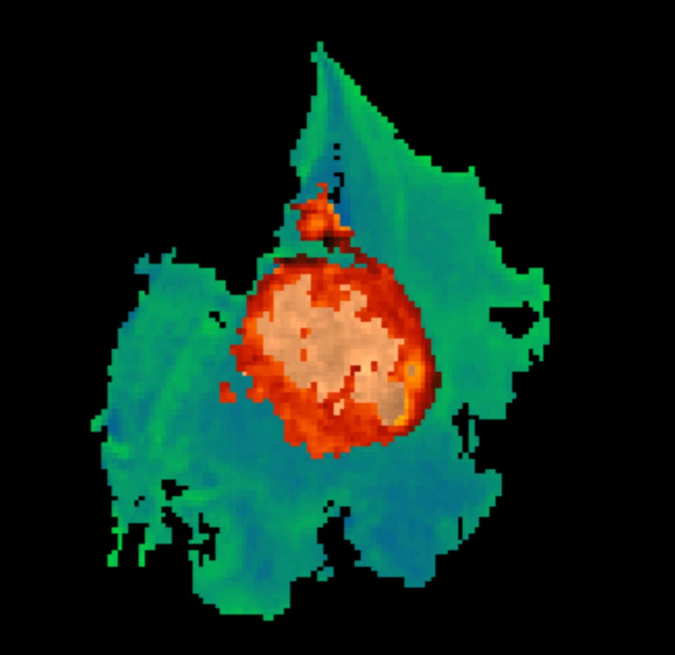
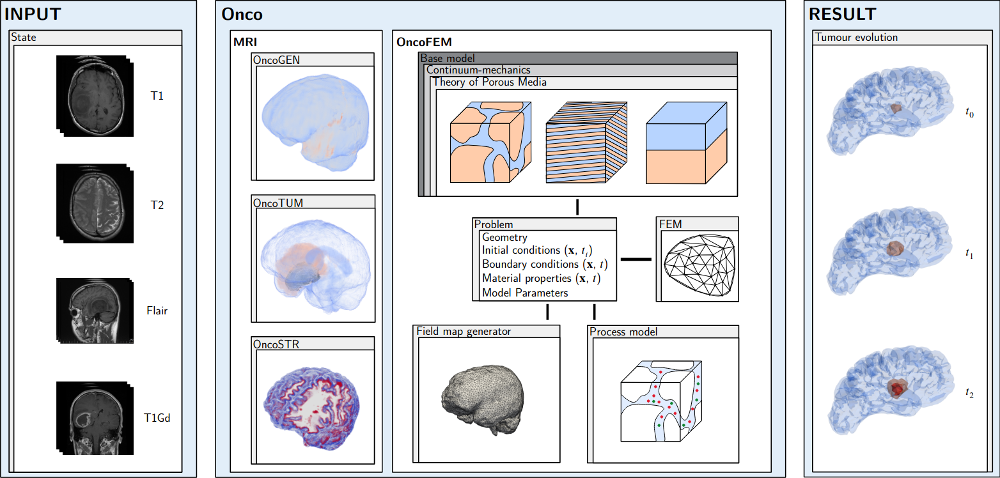

# OncoSTR
[](https://www.repostatus.org/#active) 

OncoSTR is a **str**uctural segmentation package for medical images that are distorted due to a **onco**logical disease.
To perform the segmentation processes, the fast algorithm of fsl [1] is used. This algorithm builds on a k-means 
clustering and compares probability-intensity gaussian functions of the different compartments. To take account of the
distorted area, two different approaches are presented. For this purpose, a previously created tumour segmentation is 
used and the identified areas are treated separately. The exact procedure is explained in more detail in Suditsch et 
al. [2], but some exemplary results are shown in the following.

* [Exemplary results](#examplary-results)
* [Integration of OncoFEM](#integration)
* [Software availability](#software)
* [Installation and machine requirements](#installation)
* [Tutorial](#tutorial)
* [How to develop](#howtodevelop)
* [How to cite](#howtocite)
* [Literature](#literature)

## <a id="examplary-results"></a> Exemplary results

The first image shows the tumor agnostic mode, where the images are simply segmented with fsl's fast algorithm, without
any preparation.
<p align="center">
 
</p>
Since both presented approaches cut the healthy brain area and segment it separately, the next image holds for both.
Here only the segmented brain is shown.
<p align="center">
 
</p>
The next image shows the *bias corrected* mode. In short, herein the tumour area is cut and and both (healthy and tumor)
images are segmented with fsl's fast algorithm separately.
<p align="center">
 
</p>
Finally, the last images show the *tumor entity weighted* mode. Herein, the tumour area is again cut from the healthy
brain tissue and it is taken advantage of the distinct compartments of the tumour. Therefore, it is separated again into
the particular classes of the tumour segmentation (according to BraTS into edema, active and necrotic core). In this
areas the gray scale of the image is normalised.
<p align="center">
 
</p>

## <a id="integration"></a> Integration of OncoSTR
OncoSTR is part of a module based umbrella software project for numerical simulations of patient-specific cancer 
diseases, see following figure. From given input states of medical images the disease is modelled and its evolution is 
simulated giving possible predictions. In this way, a digital cancer patient is created, which could be used as a basis for 
further research, as a decision-making tool for doctors in diagnosis and treatment and as an additional illustrative 
demonstrator for enabling patients understand their individual disease. All parts resolve to an open-access framework, 
that is ment to be an accelerator for the digital cancer patient. Each module can be installed and run independently. 
The current state of development comprises the following modules

- OncoFEM (https://github.com/masud-src/OncoFEM)
- OncoGEN (https://github.com/masud-src/OncoGEN)
- OncoTUM (https://github.com/masud-src/OncoTUM)
- OncoSTR (https://github.com/masud-src/OncoSTR)
<p align="center">
 
</p>

## <a id="software"></a> Software availability
You can either follow the installation instruction below or use the already pre-installed virtual boxes via the 
following Links:

- Version 0.1.0:  https://doi.org/10.18419/darus-4651

## <a id="installation"></a> Installation and Machine Requirements

There are two different options the installation can be done. First, is the stand-alone installation, where OncoSTR is
simply installed in an Anaconda environment. The other way is to install OncoFEM (https://github.com/masud-src/OncoFEM) 
first and add the missing packages. During the installation process you will be asked how the installtion should be 
perfomed. This installation was tested on
- a virtual box created with a linux mint 21.2 cinnamon, 64 bit system and 8 GB RAM on a 
local machine (intel cpu i7-9700k with 3.6 GHz, 128 GB RAM). 
- a MacBook Pro (Mac14,7) with a Apple M2 Chip (8 cores) and 24 GB memory. The integrated GPU got 10 cores.

The following script will download all maybe missing prerequisites and will install fsl on your system. Please be ready
to go through an installation dialog. You will be asked if you want to install OncoSTR as stand-alone or in the OncoFEM
environment and how the installation of fsl should be done. Please restart the terminal hereafter.
````bash
git clone https://github.com/masud-src/OncoSTR/
cd OncoSTR
chmod +x install_prerequisites.sh
./install_prerequisites.sh
````
Now the installation of OncoSTR can be done with
````bash
chmod +x install_oncostr.sh
./install_oncostr.sh
````
The package can now be used. To test the correct installation, run a python script with the following code line.
````bash
import oncostr
````

## <a id="tutorial"></a> Tutorial

There is an tutorial for the umbrella software project provided on DaRUS 
(https://darus.uni-stuttgart.de/dataset.xhtml?persistentId=doi:10.18419/darus-4639). You can download and run the
tutorial_structure_segmentation.py file by run the following lines in your desired directory.
````bash
curl --output tutorial https:/darus.uni-stuttgart.de/api/access/dataset/:persistentId/?persistentId=doi:10.18419/darus-4639
````
To run this tutorial, you also need to download the first training dataset from kaggle 
(https://www.kaggle.com/datasets/awsaf49/brats20-dataset-training-validation). Either you download from the web
interface and save it in the following location
````bash
tutorial/data/BraTS/BraTS20_Training_001
````
or you use the kaggle API. Be aware that this will download the full set and its recommended to use the web interface
````bash
kaggle datasets download -d awsaf49/brats20-dataset-training-validation -p .
unzip brats20-dataset-training-validation.zip "BraTS20_Training_001/*"  -d ./tutorial/data/BraTS/
````
The tutorial can be started with
````bash
conda activate oncostr
python oncostr_tut_01_modes.py
````

## <a id="howto"></a> How to develop

You can modify the existing algorithms, respectively expand the existing by your own. Therefore, you can fork and ask 
for pull requests.

## <a id="howtocite"></a> How to cite

If you are using using OncoFEM please also cite the related publication

**Onco*: An umbrella Python framework for modelling and simulation of oncological scenarios**. Marlon Suditsch, Arndt Wagner, Tim Ricken, Journal of Computational Science (2025). [10.1016/j.jocs.2025.102533](https://doi.org/10.1016/j.jocs.2025.102533)
```bib
@article{SUDITSCH2025102533,
title = {Onco*: An umbrella Python framework for modelling and simulation of oncological scenarios},
journal = {Journal of Computational Science},
pages = {102533},
year = {2025},
issn = {1877-7503},
doi = {https://doi.org/10.1016/j.jocs.2025.102533},
url = {https://www.sciencedirect.com/science/article/pii/S1877750325000109},
author = {Marlon Suditsch and Arndt Wagner and Tim Ricken},
}
```

## <a id="literature"></a> Literature

<sup>1</sup> M. Jenkinson, C.F. Beckmann, T.E. Behrens, M.W. Woolrich, S.M. Smith. FSL. NeuroImage, 62:782-90, 2012

